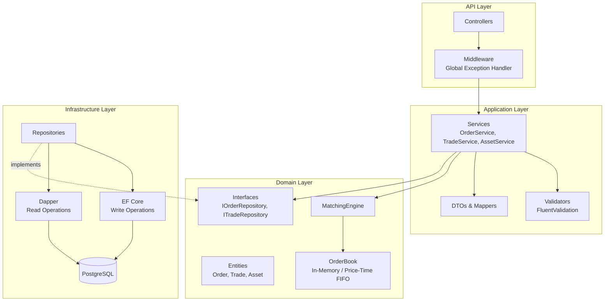

# 🏦 Polaris Exchange API

[](https://github.com/YOUR_USERNAME/TradingSystem/actions/workflows/ci.yml)


**High-performance matching engine** for simulated financial asset trading. Built as a portfolio project to demonstrate backend engineering skills including clean architecture patterns, domain-driven design, and modern .NET practices.

---

## 📐 Architecture



### Key Design Decisions

| Decision | Rationale |
|---|---|
| **In-memory OrderBook** | `SortedDictionary<decimal, Queue<Order>>` for O(log n) insert with price-time FIFO priority |
| **EF Core (write) + Dapper (read)** | EF Core for change tracking and transactions; Dapper for high-performance read queries |
| **Singleton MatchingEngine** | Holds all OrderBooks in a `ConcurrentDictionary` for thread-safe access |
| **FluentValidation** | Decoupled validation rules, easily testable |
| **Serilog** | Structured logging with trade-level observability |

---

## 🚀 Tech Stack

- **Runtime:** .NET 9 / C# 13
- **Database:** PostgreSQL 16
- **ORM:** Entity Framework Core 9 (write) + Dapper (read)
- **Validation:** FluentValidation
- **Logging:** Serilog
- **Testing:** xUnit + FluentAssertions + Moq
- **Containerization:** Docker + Docker Compose
- **CI/CD:** GitHub Actions
- **MCP Server:** Model Context Protocol SDK for AI agent integration

---

## 📦 Project Structure

```
TradingSystem/
├── .github/workflows/ci.yml       # CI pipeline
├── docker-compose.yml              # API + PostgreSQL
├── Dockerfile                      # Multi-stage build
│
├── TradingSystem/                  # Main API project
│   ├── Domain/
│   │   ├── Entities/               # Order, Trade, Asset
│   │   ├── Enums/                  # OrderSide, OrderStatus
│   │   ├── Interfaces/             # Repository contracts
│   │   └── Services/               # OrderBook, MatchingEngine
│   ├── Application/
│   │   ├── DTOs/                   # Request/Response models
│   │   ├── Interfaces/             # Service contracts
│   │   ├── Services/               # Business logic orchestration
│   │   ├── Validators/             # FluentValidation rules
│   │   └── Mappers/                # Entity ↔ DTO mapping
│   ├── Infrastructure/
│   │   ├── Persistence/            # DbContext, EF configs, Repositories
│   │   └── DependencyInjection.cs  # IoC registration
│   ├── Controllers/                # REST endpoints
│   └── Middlewares/                # Global error handling
│
├── src/TradingSystem.McpServer/    # MCP Server for AI agents
│   └── Tools/                      # MCP tools (GetOrders, PlaceOrder, etc.)
│
└── tests/TradingSystem.Tests/      # Unit tests
    ├── Domain/                     # OrderBook & MatchingEngine tests
    └── Application/                # Validator tests
```

---

## 🏃 Getting Started

### Prerequisites

- [Docker](https://www.docker.com/get-started) & Docker Compose
- [.NET 9 SDK](https://dotnet.microsoft.com/download/dotnet/9.0) (for local development)

### Run with Docker Compose (recommended)

```bash
docker compose up --build
```

The API will be available at **http://localhost:5008/swagger**

### Run locally

```bash
# Start PostgreSQL only
docker compose up postgres -d

# Run the API
cd TradingSystem
dotnet run
```

---

## 📡 API Endpoints

### Assets

| Method | Endpoint | Description |
|--------|----------|-------------|
| `POST` | `/api/assets` | Create a new tradeable asset |
| `GET` | `/api/assets` | List all assets |
| `GET` | `/api/assets/{id}` | Get asset by ID |

### Orders

| Method | Endpoint | Description |
|--------|----------|-------------|
| `POST` | `/api/orders` | Place a new limit order |
| `GET` | `/api/orders/{id}` | Get order by ID |
| `GET` | `/api/orders/user/{userId}` | Get orders by user |
| `GET` | `/api/orders/book/{assetId}` | Get order book (bids/asks) |
| `DELETE` | `/api/orders/{id}?assetId=` | Cancel an order |

### Trades

| Method | Endpoint | Description |
|--------|----------|-------------|
| `GET` | `/api/trades/asset/{assetId}` | Trades by asset |
| `GET` | `/api/trades/user/{userId}` | Trades by user |
| `GET` | `/api/trades/recent?count=50` | Recent trades |

### Positions

| Method | Endpoint | Description |
|--------|----------|-------------|
| `GET` | `/api/positions/{userId}` | User portfolio positions |

### Example: Full Trading Flow

```bash
# 1. Create an asset
curl -X POST http://localhost:5008/api/assets \
  -H "Content-Type: application/json" \
  -d '{"symbol": "PETR4", "name": "Petrobras PN"}'

# 2. Place a sell order (using the assetId from step 1)
curl -X POST http://localhost:5008/api/orders \
  -H "Content-Type: application/json" \
  -d '{
    "assetId": "<ASSET_ID>",
    "userId": "11111111-1111-1111-1111-111111111111",
    "price": 35.50,
    "quantity": 100,
    "side": "Sell"
  }'

# 3. Place a matching buy order → trade is generated!
curl -X POST http://localhost:5008/api/orders \
  -H "Content-Type: application/json" \
  -d '{
    "assetId": "<ASSET_ID>",
    "userId": "22222222-2222-2222-2222-222222222222",
    "price": 35.50,
    "quantity": 100,
    "side": "Buy"
  }'

# 4. Check the order book
curl http://localhost:5008/api/orders/book/<ASSET_ID>

# 5. Check recent trades
curl http://localhost:5008/api/trades/recent
```

---

## 🤖 MCP Server (AI Agent Integration)

The project includes a **Model Context Protocol (MCP) Server** that allows AI assistants (like Claude Desktop) to interact with the trading API.

### Available Tools

| Tool | Description |
|------|-------------|
| `GetAssets` | List all tradeable assets |
| `GetOrderBook` | View current bids/asks for an asset |
| `GetOrders` | Get orders for a user |
| `GetRecentTrades` | View recent trade executions |
| `GetTradesByAsset` | Get trade history for an asset |
| `GetPositions` | View user portfolio |
| `PlaceOrder` | Submit a buy/sell order |

### Setup with Claude Desktop

Add to your `claude_desktop_config.json`:

```json
{
  "mcpServers": {
    "polaris-exchange": {
      "command": "dotnet",
      "args": ["run", "--project", "C:/path/to/TradingSystem/src/TradingSystem.McpServer"],
      "env": {
        "POLARIS_API_URL": "http://localhost:5008"
      }
    }
  }
}
```

---

## 🧪 Testing

```bash
dotnet test --verbosity normal
```

**35 unit tests** covering:
- **OrderBook**: matching, partial fills, price-time priority, cancellation, bid/ask levels
- **MatchingEngine**: multi-asset routing, trade generation, status updates
- **Order Entity**: fill logic, status transitions
- **Validators**: FluentValidation rules for orders and assets

---

## 🔧 Matching Engine Details

The matching engine implements **Price-Time Priority (FIFO)**:

1. **Price Priority**: Best price always matches first (lowest ask for buys, highest bid for sells)
2. **Time Priority**: At the same price level, the oldest order matches first (FIFO queue)
3. **Partial Execution**: Orders can be partially filled; remaining quantity stays in the book
4. **Resting Price**: Trades execute at the resting order's price, not the aggressive order's

```
Buy Orders (Bids)          Sell Orders (Asks)
─────────────────          ──────────────────
100.00  │  50 units        101.00  │  30 units
 99.50  │  25 units        102.00  │  45 units
 99.00  │ 100 units        105.00  │  10 units

         Spread: 1.00
```

---

## 📄 License

This project is open source and available under the [MIT License](LICENSE).
